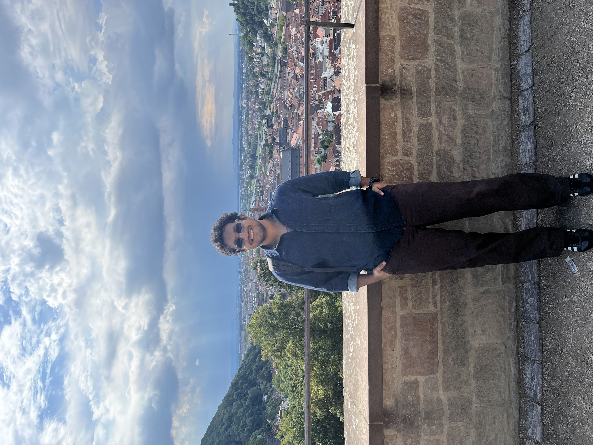

# **Amey Wankhede**

**Embedded Systems & C/C++ Development**  
Werkstudent at IBS Ingenieurbüro GmbH, Darmstadt  
MSc Information & Communications Engineering (Embedded Systems), TU Darmstadt

  

  

    <h2>About Me</h2>
    

      I work on modern C++, embedded systems, hardware-near debugging, and production firmware.
      Strong interest in automotive, robotics, high-performance systems, and system-level engineering.
      Direct, structured, and execution-focused.
    

  

---

## **Experience**

### **IBS – Werkstudent (C++ / Embedded)**
- Modern C++ development on production systems  
- Hardware-near tasks, debugging, and test workflows  
- Development processes with Git, Jira, CI/CD pipelines  

### **VMware – Software Engineer**
- Performance-critical C/C++ data-plane work  
- Debugging and resolving low-level networking issues  
- Test automation and internal tooling  

---

## **Skills**

- **Programming Languages:** C, C++, Python  
- **Tools & Technologies:** GDB, Linux, CLI tooling, Git, Jira, Jenkins, Doxygen, static analysis / linting, Confluence  
- **Software Engineering:** OOP, unit testing, memory management, TCP/IP, debugging, data structures and algorithms  
- **Soft Skills:** Strong work ethic, independent, quick learner, problem solving, detail-oriented, team collaboration  

---

## **Projects**

- EEPROM/I2C flashing utility (IBS)  
- Firmware tools and client-facing development (IBS)  
- Data-plane caching implementation (VMware)  
- Fullstack dashboard for a university project (TU Darmstadt)  
- Motion-based camera tracking (Embedded Hands-On Lab, TU Darmstadt)  
- Embedded systems coursework at TU Darmstadt  

---

## **Contact**

- **GitHub:** https://github.com/WankhedeAmey  
- **LinkedIn:** https://www.linkedin.com/in/amey-wankhede/  
- **Email:** wankhede.ameyb@gmail.com  